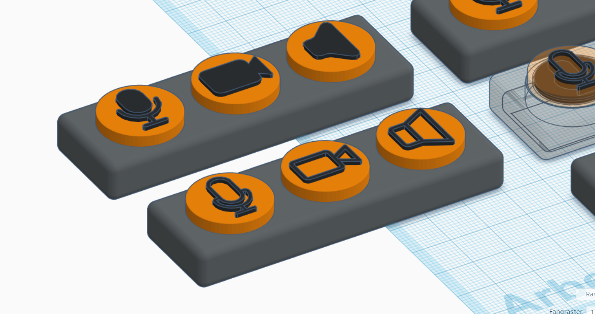

# MuteBoard

With the preview release of the new [Windows PowerToys video conference mute feature](https://github.com/microsoft/PowerToys/wiki/Video-Conference-Mute-Overview), the idea came up to have buttons on my desk to control camera, mic and speakers easily. The idea of MuteBoard was born.

## How to run

_(coming soon...)_